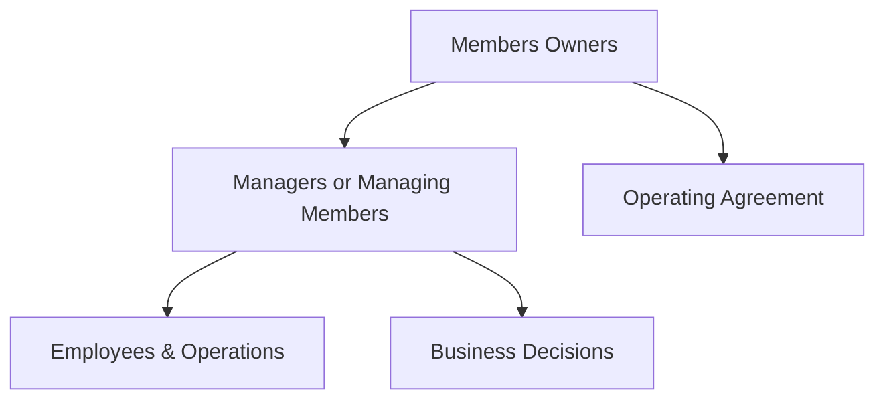

## 🏢 What is an LLC?
An **LLC** is a flexible business structure that combines the **limited liability** of a corporation with the **tax benefits and simplicity** of a partnership or sole proprietorship.

---

## 🔑 Key Features

| Feature | Description |
|--------|-------------|
| **Legal Entity** | Separate from its owners (called *members*) |
| **Ownership** | Owned by one or more *members* |
| **Management** | Can be *member-managed* or *manager-managed* |
| **Liability** | Members have limited personal liability |
| **Taxation** | Pass-through taxation (by default) |
| **Flexibility** | Fewer formalities than corporations |
| **Continuity** | May dissolve upon member exit (unless stated otherwise in the operating agreement) |

---

## 🧾 Taxation Overview

By default:
- LLCs **don’t pay federal income tax** as a business entity.
- Profits and losses "pass through" to members, who report it on their personal tax returns.

But:
- LLCs can **elect to be taxed as a C Corp or S Corp** for strategic reasons.

---

## 👥 Membership & Ownership

- Ownership is expressed in **membership interests**.
- New members can be added through an **Operating Agreement**.
- **Profit-sharing** and **voting power** don’t have to match ownership percentages (flexible).

> LLCs don’t issue "shares" like a corporation but still allow for structured ownership.

---

## 🔁 Ownership Change and Dilution

- Admitting a new member may **dilute** the economic or voting interest of existing members.
- Dilution is **negotiated** rather than automatic, unlike corporations.
- The **Operating Agreement** governs how ownership changes happen.

---

## 🧠 Organizational Structure



- LLCs can be:
  - **Member-managed**: All members participate in day-to-day operations.
  - **Manager-managed**: Members appoint a manager to run the business.

---

## ✅ Advantages

- Limited liability protection
- Pass-through taxation (no double tax)
- Less paperwork and formality than a corporation
- Flexible ownership and profit distribution

---

## ❌ Disadvantages

- Can be harder to raise capital (no stock issuance)
- Ownership transfer may be restricted
- Varies heavily by state law
- May be seen as less "established" than a corporation by investors

---

## 📄 Example: Adding a New Member

```text
LLC Alpha has 2 members:
- Alice owns 60%
- Bob owns 40%

They admit Carol as a new member with 30% ownership.

New structure:
- Alice: 42%
- Bob: 28%
- Carol: 30%

→ Ownership is updated based on negotiated terms (not automatic).
```

---

Let me know if you'd like a side-by-side comparison chart of **C Corp vs LLC**, or a note version tailored to startup founders, investors, or tax planning!

---
Tags: #finance #investing


#Core_Concepts_and_Terminology
