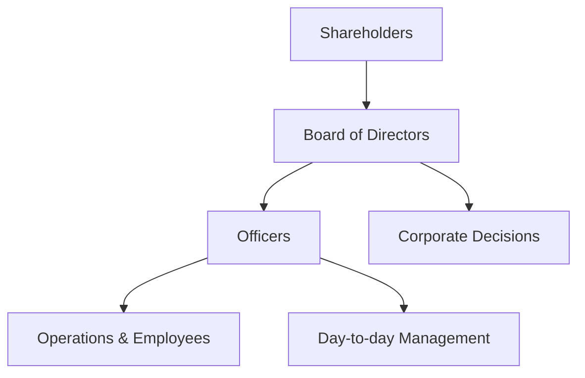

## 🏢 What is a C Corporation?
A **C Corporation (C Corp)** is a legal business structure recognized as a **separate entity** from its owners. It can enter into contracts, sue and be sued, own assets, and pay taxes independently of its shareholders.

---

## 🔑 Key Features

| Feature | Description |
|--------|-------------|
| **Legal Entity** | Separate from its owners (shareholders) |
| **Ownership** | Owned by shareholders who hold stock |
| **Management** | Managed by a Board of Directors and Officers |
| **Liability** | Limited liability protection for shareholders |
| **Taxation** | Subject to **double taxation** (corporate and individual) |
| **Continuity** | Perpetual existence regardless of ownership changes |
| **Raising Capital** | Can issue shares to raise money from investors |

---

## 📊 Double Taxation Explained

1. The corporation pays income tax on its profits.
2. When profits are distributed as dividends, shareholders pay tax on those dividends.

> This means the same income can be taxed **twice**—once at the corporate level and once at the individual level.

---

## 🔁 Ownership and Dilution

- Shares can be **freely transferred** or sold.
- New shares can be **issued** to raise capital.
- Issuing new shares leads to **dilution**:
  - Existing shareholders’ ownership percentage decreases unless they buy new shares too.

---

## 🧠 Organizational Structure



---

## ✅ Advantages

- Limited liability for owners
- Easier to raise capital
- Perpetual existence
- Credibility with investors and banks

---

## ❌ Disadvantages

- Double taxation
- Costly and complex to set up and maintain
- More regulatory requirements

---

## 📄 Example: Issuing New Shares

```text
Company ABC has 1,000 shares.
- Alice owns 400 shares (40%)
- Bob owns 600 shares (60%)

ABC issues 1,000 new shares to a new investor, Carol.

New total: 2,000 shares
- Alice: 400/2000 = 20%
- Bob: 600/2000 = 30%
- Carol: 1000/2000 = 50%

→ Alice and Bob are diluted.
```

---

Let me know if you want a similar one for **LLC**, or tailored for startup founders, investors, or legal comparison!

---
Tags: #finance #investing


#Core_Concepts_and_Terminology
