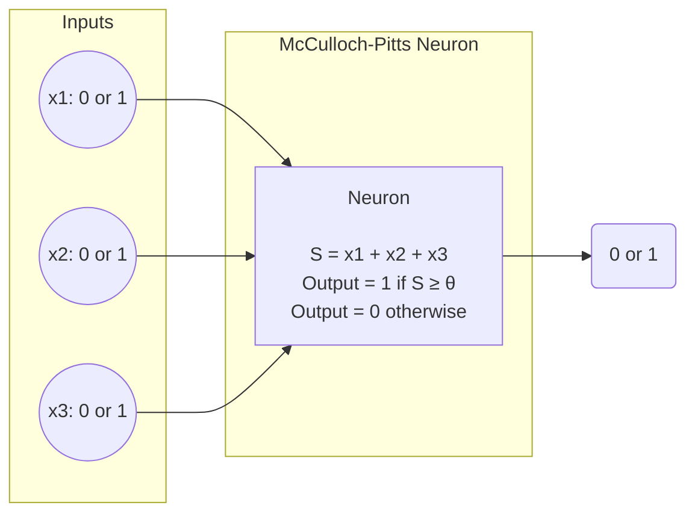

The **McCulloch-Pitts Neuron Model** is the **first mathematical model of a neuron**, proposed by **Warren McCulloch**and **Walter Pitts** in 1943. It's a **binary threshold unit** that mimics how a biological neuron fires based on inputs.

It laid the **foundation for modern neural networks** — including perceptrons and deep learning.

## 🌟 Ambition of the Model

The main **goal** of the McCulloch-Pitts model was to **mathematically simulate how neurons in the brain might work**, using **logic** and **binary signals**.

## 🧩 Components of the McCulloch-Pitts Neuron

1. **Binary Inputs**
    
    - Inputs $x_1, x_2, ..., x_n$ can only be **0 or 1**.
    - Represents whether a stimulus is **inactive (0)** or **active (1)**.
2. **No Weights**
    
    - All inputs are treated **equally** — there are **no weights**.
    - Each input contributes **1 unit** to the sum if it's active.
3. **Threshold (θ)**
    
    - The neuron **fires (outputs 1)** only if the **sum of active inputs ≥ threshold θ**.
    - Otherwise, it outputs 0.
4. **Output**
    
    - The output is binary (0 or 1), simulating the **all-or-nothing firing** of a biological neuron.

## 🔄 Behavior of the Neuron

The model computes:

$$S = \sum_{i=1}^{n} x_i$$

Then applies a **threshold function**:

$$\text{output} = \begin{cases} 1 & \text{if } S \geq \theta \ 0 & \text{if } S < \theta \end{cases}$$

## 💡 Logic Gate Simulation

McCulloch-Pitts neurons can implement **logic gates** by setting inputs and threshold cleverly.

### ✔️ AND Gate

- Inputs: $x_1$, $x_2$
- Threshold: $\theta = 2$

|$x_1$|$x_2$|Output|
|---|---|---|
|0|0|0|
|0|1|0|
|1|0|0|
|1|1|1|

### ✔️ OR Gate

- Inputs: $x_1$, $x_2$
- Threshold: $\theta = 1$

|$x_1$|$x_2$|Output|
|---|---|---|
|0|0|0|
|0|1|1|
|1|0|1|
|1|1|1|

### ❌ XOR Limitation

The model **cannot simulate XOR**, because XOR is **not linearly separable**.

|$x_1$|$x_2$|Output (XOR)|
|---|---|---|
|0|0|0|
|0|1|1|
|1|0|1|
|1|1|0|

👉 Solving XOR requires **multi-layer networks** — something McCulloch-Pitts couldn't do.

## 🧪 Summary of the McCulloch-Pitts Neuron

|Component|Description|
|---|---|
|Inputs ($x_i$)|Binary values (0 or 1)|
|Weights|Not used (all inputs equal)|
|Threshold (θ)|Minimum sum needed to fire|
|Output|Binary: 1 if sum ≥ θ, else 0|
|Activation Rule|Step function (binary threshold)|

## 🧠 Legacy & Impact

- It **introduced the idea of neurons as logic units**.
- Built the **theoretical foundation** of neural networks and AI.
- Though **too simple for real learning**, it inspired **perceptrons**, **modern activation functions**, and **deep learning**architectures.

## 🎯 Conclusion

The **McCulloch-Pitts neuron** is a **historical milestone** in AI and neuroscience. It models the brain using simple math and logic and planted the seed for everything from **perceptrons** to **transformers**.

It shows how even simple ideas can create revolutions.

---
Tags: #math #statistics

#Neural_Networks_and_Deep_Learning
