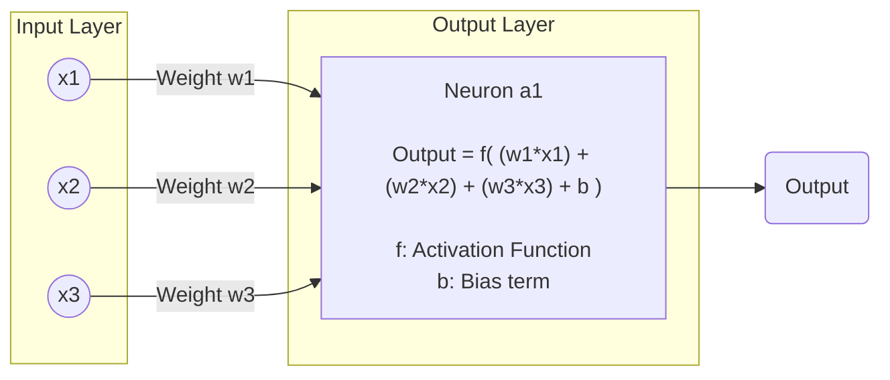

# Single Layer Perceptron

The **Single Layer Perceptron** is the simplest type of artificial neural network. It consists of a single layer of output nodes connected to the input features. It's a **linear classifier**, which means it can only classify linearly separable data.

---

## 🌟 Ambition of Perceptron

The main **goal** of a perceptron is to learn the **correct weights** and **bias** so that it can classify the input data correctly into two classes.

---

## 🧠 Components of a Perceptron

### 1. **Input Layer**
- The input layer takes feature values from the dataset.
- Each feature is denoted as $x_i$, where $i = 1, 2, ..., n$.

### 2. **Weights**
- Each input feature has an associated **weight** $w_i$.
- These weights determine the importance of each feature.

### 3. **Bias**
- A **bias** term $b$ allows the model to shift the decision boundary.
- Without bias, the model is forced to go through the origin.

#### 🔢 1. Inputs like 0 and 1

Let’s say your inputs are binary — just `0` and `1`.

That means each neuron gets values like:

$$

w \cdot x = w \cdot 0 = 0 \quad \text{or} \quad w \cdot x = w \cdot 1 = w

$$

Without **bias**, the activation is only triggered at very limited conditions:

* For $x = 0$, output is always $\sigma(0)$

* For $x = 1$, output is always $\sigma(w)$

This is **very limited behavior**. The network can only learn basic mappings.

---

#### ⚙️ 2. What Bias Actually Does

By adding **bias $b$**, you change the equation:

$$

z = w \cdot x + b

$$

Now:

* For $x = 0$, $z = b$

* For $x = 1$, $z = w + b$

This **increases the range of outputs** and gives more flexibility:

* It helps neurons **respond differently to 0 and 1**

* Even with simple inputs like 0 and 1, the network can now **create more varied outputs**, because of how bias shifts the activation

---

#### 🧠 3. What If Inputs Change?

Exactly! If your input changes later — say, now you get `0.5`, `1.2`, or even `-0.8` — **bias helps the neuron still compute a meaningful response**, rather than just failing or always outputting the same thing.

---

#### ✅ So in Short:

* **Bias doesn’t create variation in inputs** — it allows **neurons to better respond** to variations that are already there.

* It’s like giving the network **adjustable sensitivity** to different input ranges, even if they’re small (like 0/1).
* 

### 4. **Weighted Sum**
- The input values are multiplied by the corresponding weights and summed together with the bias:
$$
z = w_1x_1 + w_2x_2 + \dots + w_nx_n + b = \sum_{i=1}^n w_i x_i + b
$$

### 5. **Activation Function**
- The activation function decides the output of the neuron.
- In the single-layer perceptron, the common activation function is the **step function** (also known as the Heaviside function):
$$
\text{output} = f(z) = 
\begin{cases}
1 & \text{if } z \geq 0 \\
0 & \text{if } z < 0
\end{cases}
$$

---

## 🔁 Training the Perceptron

Training involves updating the weights and bias to minimize classification errors.

### 1. **Prediction**
- For each input sample, calculate:
$$
z = \sum_{i=1}^n w_i x_i + b
$$
$$
\hat{y} = f(z)
$$

### 2. **Error**
- Compare prediction $\hat{y}$ with true label $y$:
$$
\text{Error} = y - \hat{y}
$$

### 3. **Update Rules**
- For each weight:
$$
w_i := w_i + \eta (y - \hat{y}) x_i
$$
- For bias:
$$
b := b + \eta (y - \hat{y})
$$

Where:
- $\eta$ = Learning rate (a small constant, e.g., 0.01)
- $y$ = Actual label (0 or 1)
- $\hat{y}$ = Predicted label
- $x_i$ = Input feature

---

## 🧪 Summary of the Perceptron Algorithm

1. Initialize weights $w_i$ and bias $b$ with small random values.
2. For each training example:
   - Compute $z = \sum w_i x_i + b$
   - Apply activation function to get output $\hat{y}$
   - Update weights and bias using the update rules
3. Repeat until convergence (no change in weights or small enough error).

---

## 🔍 Important Terms Explained

| Term               | Description |
|--------------------|-------------|
| $x_i$          | Input features |
| $w_i$          | Weight associated with each input |
| $b$            | Bias term |
| $z$            | Weighted sum of inputs plus bias |
| $\hat{y}$      | Predicted output |
| $y$            | Actual output |
| $\eta$         | Learning rate |
| Activation Function| Function that determines the output from $z$ |

---

## ✅ Limitations

- Can only classify **linearly separable** data.
- Cannot solve problems like XOR (needs multi-layer perceptron for that).

---

## 📌 Example
###  🎓 Perceptron Example — Predicting Pass Based on Study and Sleep Hours

We will train a **Single Layer Perceptron** to predict whether a student **passes** an exam based on:

- $x_1$: Hours of Study
- $x_2$: Hours of Sleep
- $y$: 1 if Pass, 0 if Fail

---

### 📊 Dataset

| Hours of Study ($x_1$) | Hours of Sleep ($x_2$) | Pass ($y$) |
| ---------------------- | ---------------------- | ---------- |
| 2                      | 0                      | 0          |
| 3                      | 6                      | 0          |
| 5                      | 8                      | 1          |
| 6                      | 7                      | 1          |

---

### ⚙️ Initialization

- Initial weights: $w_1 = 0$, $w_2 = 0$
- Initial bias: $b = 0$
- Learning rate: $\eta = 1$

---

### 🔁 Training (Epoch 1)

#### 🔹 Input: (2, 0), Target $y = 0$

$$
z = (0)(2) + (0)(0) + 0 = 0
$$
$$
\hat{y} = f(0) = 1 \quad \text{(Incorrect)}
$$
$$
\text{Error} = 0 - 1 = -1
$$

**Update**:
$$
w_1 := 0 + (-1)(2) = -2
$$
$$
w_2 := 0 + (-1)(0) = 0
$$
$$
b := 0 + (-1) = -1
$$

---

#### 🔹 Input: (3, 6), Target $y = 0$

$$
z = (-2)(3) + (0)(6) + (-1) = -6 + 0 - 1 = -7
$$
$$
\hat{y} = f(-7) = 0 \quad \text{(Correct)}
$$

✅ No update.

---

#### 🔹 Input: (5, 8), Target $y = 1$

$$
z = (-2)(5) + (0)(8) + (-1) = -10 - 1 = -11
$$
$$
\hat{y} = f(-11) = 0 \quad \text{(Incorrect)}
$$
$$
\text{Error} = 1 - 0 = 1
$$

**Update**:
$$
w_1 := -2 + (1)(5) = 3
$$
$$
w_2 := 0 + (1)(8) = 8
$$
$$
b := -1 + (1) = 0
$$

---

#### 🔹 Input: (6, 7), Target $y = 1$

$$
z = (3)(6) + (8)(7) + (0) = 18 + 56 = 74
$$
$$
\hat{y} = f(74) = 1 \quad \text{(Correct)}
$$

✅ No update.

---

### ✅ Final Weights After 1 Epoch

- $w_1 = 3$
- $w_2 = 8$
- $b = 0$

---

### 🧪 Test All Inputs with Final Parameters

| Input $(x_1, x_2)$ | $z$ Calculation                  | $\hat{y}$ | Correct? |
| ------------------ | -------------------------------- | --------- | -------- |
| (2, 0)             | $3(2) + 8(0) + 0 = 6$            | 1         | ❌        |
| (3, 6)             | $3(3) + 8(6) + 0 = 9 + 48 = 57$  | 1         | ❌        |
| (5, 8)             | $3(5) + 8(8) + 0 = 15 + 64 = 79$ | 1         | ✅        |
| (6, 7)             | $3(6) + 8(7) + 0 = 18 + 56 = 74$ | 1         | ✅        |

---

### 📌 Observations

- After 1 epoch, the model still misclassifies two inputs.
- More epochs are needed to fully converge.
- The perceptron is trying to find a **linear boundary** between pass/fail.

---

### 🧠 Key Formula Recap

$$
z = w_1x_1 + w_2x_2 + b
$$
$$
\hat{y} =
\begin{cases}
1 & \text{if } z \geq 0 \\
0 & \text{if } z < 0
\end{cases}
$$
$$
w_i := w_i + \eta \cdot (y - \hat{y}) \cdot x_i
$$
$$
b := b + \eta \cdot (y - \hat{y})
$$

---

## 🎯 Conclusion

A single-layer perceptron is a fundamental building block of neural networks. It’s simple but limited to linearly separable problems. It introduces the core concepts used in more complex networks like weights, bias, and activation functions.

---

---
Tags: #deep-learning #neural-networks

#Neural_Networks_and_Deep_Learning
