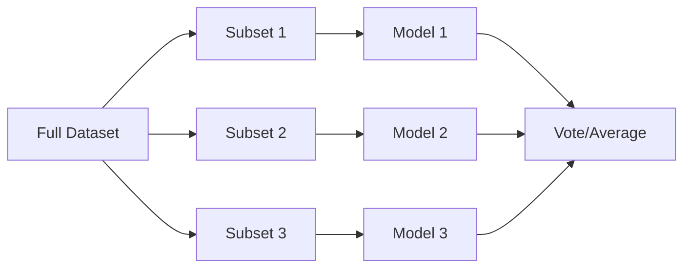
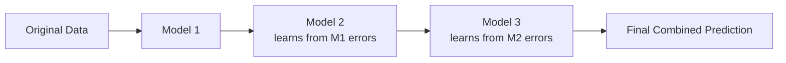
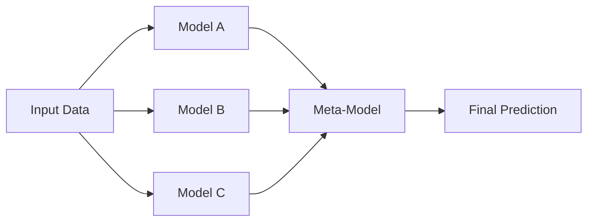

 Ensemble Techniques in Machine Learning

Ensemble techniques combine multiple machine learning models to produce a more powerful, accurate, and robust prediction than a single model.

---

## 🔍 What is an Ensemble Technique?

> An **ensemble technique** is a method where multiple base models (often called **weak learners**) are combined to form a **strong learner**.

Ensembling helps to reduce:
- **Bias**  (under fitting)
- **Variance** (overfitting )
- **Overfitting** (in some methods)

---

## 🧠 Types of Ensemble Techniques

### 1. Bagging (Bootstrap Aggregating)

- **Goal:** Reduce variance.
- **How it works:** 
  - Multiple models are trained independently on **random subsets** of the data (with replacement).
  - Their predictions are then **averaged** (for regression) or **voted** (for classification).
- **Example:** `Random Forest`

---

### 2. Boosting

- **Goal:** Reduce both bias and variance.
- **How it works:** 
  - Models are trained **sequentially**.
  - Each new model tries to **correct the errors** of the previous one.
  - Final prediction is a **weighted sum** of all models.
- **Example:** `AdaBoost`, `Gradient Boosting`, `XGBoost`

---

### 3. Stacking

- **Goal:** Combine strengths of different model types.
- **How it works:**
  - Multiple diverse models are trained in **parallel**.
  - Their outputs are fed into a **meta-model** that makes the final prediction.
- **Example:** Using Logistic Regression as a meta-learner over Decision Trees, SVMs, etc.

---

## ✅ Summary Table

| Technique | Base Models | Training | Strength      | Example         |
|-----------|-------------|----------|----------------|------------------|
| Bagging   | Same type   | Parallel | Reduces variance | Random Forest   |
| Boosting  | Same type   | Sequential | Reduces bias & variance | XGBoost        |
| Stacking  | Different types | Parallel + Meta | Leverages diversity | VotingClassifier |

---

## 🧠 When to Use What?

- **Bagging**: When the model has **high variance** (like decision trees).
- **Boosting**: When the model has **high bias** (underfitting).
- **Stacking**: When you want to **blend multiple model types** for performance.

---

---
Tags: #math #statistics

#Models_and_Techniques
