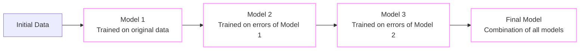

# Boosting: An Ensemble Technique

**Boosting** is an [[Ensemble Technique]] where models are trained **sequentially**, and each new model learns from the **errors of the previous models**.

### Key Points:
- Models are built **one after another**.
- Each model tries to **correct the mistakes** made by the earlier models.
- This sequential learning forms an **additive process**, where every new model adds improvements to the ensemble.

In simple terms, boosting helps create a **strong model** by combining several **weak learners** that focus on correcting each other's errors.

---
Tags: #math #statistics

#Models_and_Techniques
