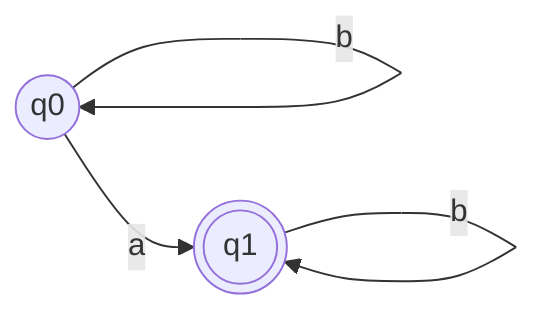
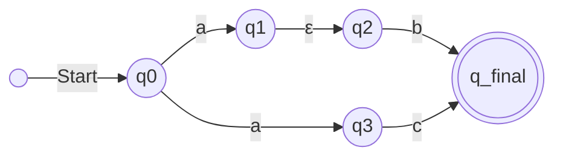

 # Finite state automata

**Finite Automata**, is the _machine_ or _method_ that's used to recognize those patterns of  [[2. regular expressions|regular expression]] .

A Finite Automaton (or FSA) is an abstract machine that reads an input string (like "good") one character at a time and then decides if it "accepts" (matches the pattern) or "rejects" (doesn't match) the string 

There are two main types :

## Deterministic Finite Automaton (DFA)

A **Deterministic Finite Automaton** (DFA) is a model of computation used to recognize patterns.

* **Key Property (Deterministic):** The "deterministic" part means that for any given state and any possible input symbol, there is **exactly one** defined next state. The machine's path is completely predictable.

---

### Formal Definition (The 5-Tuple)

A DFA is formally defined as a 5-tuple: $\{Q, \Sigma, \delta, q_0, F\}$

* **$Q$**: A finite **set of all states**.
* **$\Sigma$** (Sigma): A finite set of input symbols, called the **alphabet**.
* **$\delta$** (Delta): The **transition function**.
    * Its signature is: $\delta: Q \times \Sigma \to Q$
    * This means the function takes a *current state* (from $Q$) and an *input symbol* (from $\Sigma$) and returns the *next state* (from $Q$).
* **$q_0$**: The **initial state** (or start state). This is the state the machine begins in before reading any input. ($q_0 \in Q$)
* **$F$**: The **set of final states** (or accepting states). This can be one state, multiple states, or even no states. ($F \subseteq Q$)

### How a DFA Works

1.  **Start:** The machine begins at the **initial state** $q_0$ *before* reading the first symbol.
2.  **Read:** It reads the input string one symbol at a time, from left to right.
3.  **Transition:** For each symbol it reads, it uses the transition function ($\delta$) to determine the next state based on its *current state* and the *current input symbol*. It then moves to that next state.
4.  **Repeat:** It repeats step 3 until all symbols in the input string have been read.
5.  **Finish:** After reading the entire string, the machine stops.
6.  **Accept or Reject:**
    * If the machine's final state (the one it's in after the last symbol) **is in the set of final states $F$**, the input string is **ACCEPTED** (or "true").
    * If the machine's final state is **NOT in the set $F$**, the input string is **REJECTED** (or "false").

#### Simple Example

Imagine you have:

- States $Q = \{q_0, q_1\}$
    
- Alphabet $\Sigma = \{'a', 'b'\}$
    
- A rule: "If you are in state $q_0$ and you read an 'a', go to state $q_1$."
    

In this formal notation, that one rule is written as:

$\delta(q_0, \text{'a'}) = q_1$

This perfectly matches the signature:

- Input: ($q_0$, 'a') $\to$ This is a ($Q$, $\Sigma$) pair.
    
- Output: $q_1$ $\to$ This is an item from $Q$.

---
## Non - Deterministic finite automation (DFS):

same as DFA with Two differences 

1. **ϵ-Transitions (Your "void state E")**
    
    - An NFA can move from one state to another **without reading any input symbol**. This is like a "free" move.
        
    - A DFA **must** read an input symbol to change states.
        
2. **Multiple Next States**
    
    - In an NFA, a single state and a single input symbol (like `'a'`) can lead to **multiple different states at the same time**. It's like the path splits. and NFA **simultaneously** explores all possible paths at once
        
    - In a DFA, a state and an input symbol lead to **exactly one** state. The path is always predictable.

### Formal Definition (The 5-Tuple)

A DFA is formally defined as a 5-tuple: $\{Q, \Sigma, \delta, q_0, F\}$

* **$Q$**: A finite **set of all states**.
* **$\Sigma$** (Sigma): A finite set of input symbols, called the **alphabet**.
* **$\delta$** (Delta): The **transition function**.
    * Its signature is: ==$\delta: Q \times \Sigma \to 2^Q$==
    * This means the function takes a *current state* (from $Q$) and an *input symbol* (from $\Sigma$) and returns the *next state* (from $Q$).
* **$q_0$**: The **initial state** (or start state). This is the state the machine begins in before reading any input. ($q_0 \in Q$)
* **$F$**: The **set of final states** (or accepting states). This can be one state, multiple states, or even no states. ($F \subseteq Q$)

---

### Simple Example

### How it Works (Step-by-Step)

Let's use our last example, tracing the input `"ab"`:

1. **Start:** You are at `q0`. The next input symbol to read is 'a'.
    
2. **Read 'a':** You read the 'a'. The NFA splits.
    
    - One path goes to `q1`.
        
    - Another path goes to `q3`.
        
3. **Process ϵ-Move:** _Before_ the NFA even looks at the 'b', it checks its new states.
    
    - The path at `q3` does nothing.
        
    - The path at `q1` sees the **free ϵ-move** to `q2`. It _instantly_ takes this move _without_ reading the 'b'.
        
4. **Ready for Next Input:** The NFA has now processed the 'a' and is ready to read the 'b'. Its active "clones" are at states **{q2,q3}**.
    
5. **Read 'b':** Now it finally reads the 'b' and proceeds as we discussed before.
    

## Problem 

[Solving problems](https://youtu.be/Y92dtMnarAU)

---
Tags: #data-engineering #sql

#Miscellaneous
