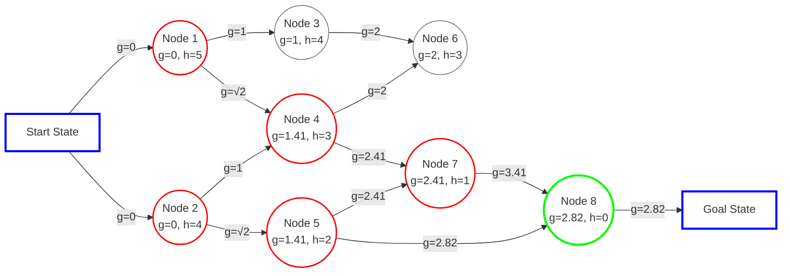
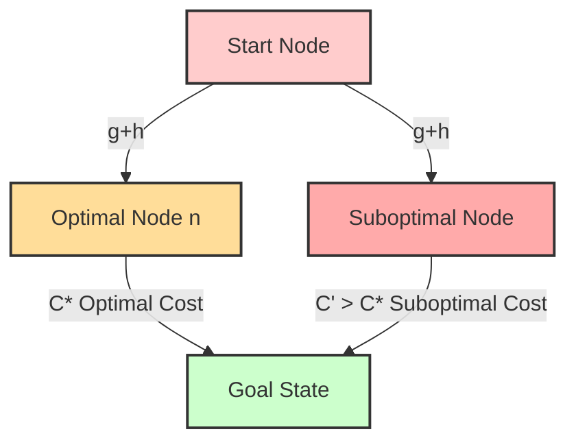

## EXPLANATION
It finds the shortest part to goal state by calculating the total of our cost of each action  differently from our current state to our next action and so until our goal state and the lowest value is chosen as the optimal solution

### Formula:
$$f(N) = g(N)+h(N)$$ 

here:
-  $N$ : is the  node
- $f(N)$: is total off cost from state to goal state is the total of GN and HN
- $g(N)$: is the cost from start to reach 
- $h(N)$: the heuristic estimate of the remaining cost to the goal ( [[Euclidean distance]],[[Manhattan distance]].. )

## **Proof of A* Admissibility**  
[yt explanation](https://www.youtube.com/watch?v=xz1Nq6cZejI)
A search algorithm is **admissible** if it always finds the **optimal solution** (i.e., the least-cost path to the goal) when one exists. 

### **Underestimation & Overestimation in A***  
#### Underestimation of h(N)
$$
h(n) \leq h^*(n)
$$
where:  
- $( h(n) )$ is the estimated cost from node $( n )$ to the goal.  
- $( h^*(n) )$ is the true cost from $( n )$ to the goal.  

#### Overestimation
$$
h(n) \geq h^*(n)
$$
where:  
- $( h(n) )$ is the estimated cost from node $( n )$ to the goal.  
- $( h^*(n) )$ is the true cost from $( n )$ to the goal.  

### **Admissibility Condition**  
A* is admissible if the heuristic function $( h(n) )$ satisfies Underestimation of h(N) :  
$$
h(n) \leq h^*(n)
$$
where:  
- $( h(n) )$ is the estimated cost from node $( n )$ to the goal.  
- $( h^*(n) )$ is the true cost from $( n )$ to the goal.  

Since A* expands nodes in order of **$( f(n) = g(n) + h(n) )$** (where $( g(n) )$ is the actual cost from the start to $( n )$), if $( h(n) )$ **never overestimates**, A* will never pick a suboptimal path over the optimal one.  

---

### **Proof (By Contradiction)**  
1. Suppose A* is using an **admissible** heuristic $( h(n) )$ (i.e., it never overestimates $( h^*(n) )$).  
2. Assume A* finds a **suboptimal solution** with cost $( C' > C^* )$, where $( C^* )$ is the optimal cost.  
3. There must exist a node on the optimal path that A* did not expand. Call this node $( n )$.  
4. Since $( h(n) )$ never overestimates $( h^*(n) )$, its $( f(n) )$ value satisfies:  
   $$
   f(n) = g(n) + h(n) \leq g(n) + h^*(n) = C^*
   $$
5. But A* should have expanded $( n )$ before returning the solution $( C' > C^* )$, which contradicts our assumption that A* picked a suboptimal path.  
6. Therefore, A* **must** always find the optimal solution, proving it is admissible.  

---
Tags: #cs #dsa

#Algorithms_and_Data_Structures
