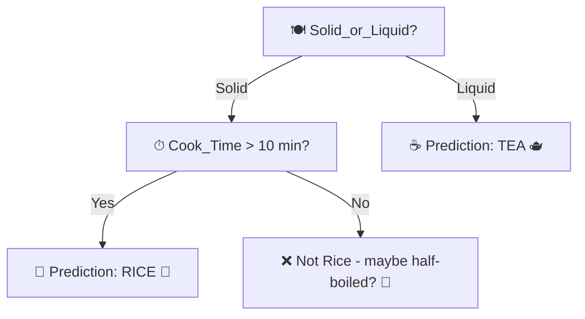
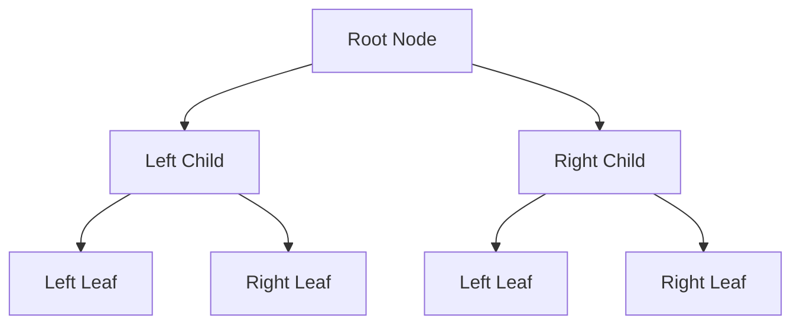
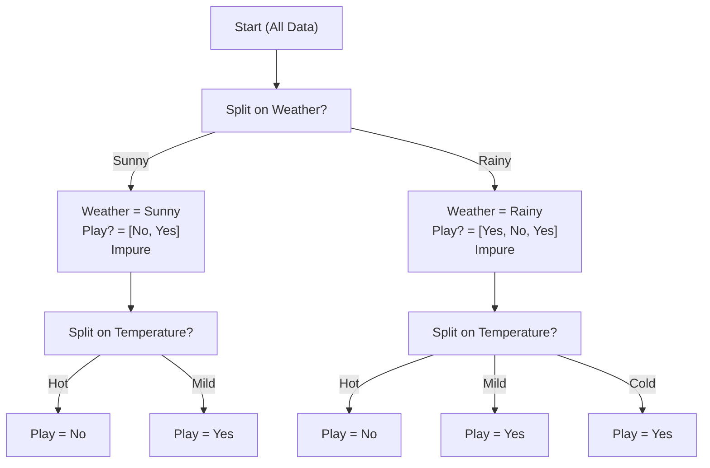

It is a classification and regression model, which will predict the outcome based on the certain set of features
## EXAMPLE

### 🍚 Pressure Cooker Decision Tree Example

> Suppose you have a **decision tree model** trained on Indian kitchen experiments.

You give it this input:

- **Item inside** = Rice  
- **Water added** = Yes  
- **Cook time** = 15 minutes  
- **Utensil used** = Pressure cooker  

👨‍🍳 The model processes these features and says:

**Prediction: RICE.**

Not **MEAT**, not **TEA**, not **LATTE**… just good old **pressure-cooked rice**.

---

> Why? Because the model was trained on all kinds of **past data** — like how to make tea, coffee, and rice ☕🍚. 
> 
> When it saw your input — rice + water + pressure cooker + 15 min — it compared it to all those recipes... 
> 
> And said, **“Aha! This matches rice the most!”** 
> 
> So it confidently predicts: **RICE**, not TEA or LATTE or MAGIC.

---


---

# Features of decisions trees
## 🌱 Root Node
- The **topmost node** in a decision tree.
- Represents the **first decision point**.
- It has **two children** in a binary tree: `left` and `right`.

---

## 🌿 Child Nodes
- Nodes that are **descendants** of another node.
- In a binary decision tree:
  - Each node can have **at most two children**.
  - Labeled as **left child** and **right child**.

---

## 🌲 Leaf Nodes (Terminal Nodes)
- Nodes with **no children**.
- Represent the **final decision or output** in the tree.
- Also called **terminal** or **end nodes**.

---

## 🌳 Depth of a Node
- The **distance** (in number of edges) from the **root node** to a specific node.
- Root node has a depth of **0**.
- Depth increases by **1** as you go down each level.

---

## 🧮 Height of the Tree
- The **longest path** from the root node to any leaf node.
- Equal to the **maximum depth** among all the nodes.
- Helps measure the **complexity** of the tree.

---

## 🔢 Tree Length
> Not a standard term in decision trees, but often confused with:
- **Number of nodes** in the tree
- **Number of leaf nodes**
- **Total number of decisions or splits**

---

## 🧭 Levels of the Tree
- A **level** is a set of nodes that are the **same distance** from the root.
- Root is at **level 0**, its children at **level 1**, and so on.

---

## 🌐 Visual Representation (Mermaid)



# Purity & Impurity
### 🌱 What is Impurity?

**Impurity** means **how mixed the data is** at a point in the tree.

- If a group (node) contains **only one type of class** → it is **pure** (impurity = 0).
- If a group contains **a mix of classes** → it is **impure**.

The **goal of a decision tree** is to split the data in such a way that:
- Each group becomes **as pure as possible** (less mixed, more one-class).
- how we achieve that is to split the most impure node first and then go on splitting the less less

---

### 🍕 Real-Life Example (Food Classification):

Imagine you're classifying foods:

| Food  | Type     |
|-------|----------|
| Pizza | Fast Food|
| Burger| Fast Food|
| Apple | Fruit    |

If you have a group like:
- `[Pizza, Burger]` → all same type = **pure** (only fast food)
- `[Pizza, Apple]` → mixed = **impure** (fast food + fruit)

---

### 📏 How is Impurity Measured?

Two common ways:

#### 1. **Gini Impurity**
- Formula:  
  $$
  Gini = 1 - \sum p_i^2
  $$  
  where \( p_i \) is the proportion of class \( i \)

- Example: `[2 Fast Food, 2 Fruit]`
  $$
  Gini = 1 - (0.5^2 + 0.5^2) = 0.5
  $$

#### 2. **Entropy** (from Information Theory)
- Formula:  
  $$
  Entropy = -\sum p_i \log_2(p_i)
  $$

- Example: `[2 Fast Food, 2 Fruit]`
  $$
  Entropy = -(0.5 \log_2 0.5 + 0.5 \log_2 0.5) = 1.0
  $$

Both values go from:
- **0** → pure (only one class)
- **Higher** → more impure (more mixed)

---

# Building binary decision  
## 🌳 Step-by-Step: How a Decision Tree Uses Impurity

### 🧠 Goal:
We want to build a tree that splits the data in the best way—**so that each split creates purer groups**.

We use **Gini** or **Entropy** to measure how "bad" (impure) a group is. Lower = better.

---

### 📌 Step 1: Try Splitting by Each Feature

Let’s say you have a dataset like this:

| Weather | Temperature | Play Football |
|---------|-------------|----------------|
| Sunny   | Hot         | No             |
| Rainy   | Mild        | Yes            |
| Sunny   | Mild        | Yes            |
| Rainy   | Hot         | No             |
| Rainy   | Cold        | Yes            |

We want to predict **Play Football** (Yes/No) using **Weather** or **Temperature**.

---

### 🔍 Step 2: For Each Feature, Do This:

#### ➤ 1. Split the data based on that feature.
For example:
- **Split on Weather**: make 2 groups — Sunny and Rainy.
- **Split on Temperature**: make 3 groups — Hot, Mild, Cold.

#### ➤ 2. Calculate the **impurity** (Gini or Entropy) of each group.

Let’s say:

- Group 1: [Yes, Yes, No] → impurity = 0.44
- Group 2: [Yes, No] → impurity = 0.5

#### ➤ 3. Calculate the **Weighted Average Impurity** of the split

This means:
$$
\text{Weighted impurity} = \frac{\text{Size of Group 1}}{\text{Total Size}} \times \text{Impurity of Group 1} + \frac{\text{Size of Group 2}}{\text{Total Size}} \times \text{Impurity of Group 2}
$$

#### ➤ 4. Repeat this for all features.

---

### 🎯 Step 3: Choose the Feature with the **Lowest Impurity After Split**

The feature that **splits the data best** (makes purer groups) is chosen to split first.

This is where **Gini** or **Entropy** helps — it's the **criteria for choosing the best feature**.

---

### 🔄 Step 4: Do It Again for Each Branch (Recursion)

After the first split, you repeat the process **on each group**, like a tree growing from the top down.

Stop when:
- The group is pure (all Yes or all No), or
- You reach a maximum tree depth, or
- There's no more improvement.

---

### ✅ Summary

| Step               | What Happens                                |
| ------------------ | ------------------------------------------- |
| Split by feature   | Try each one                                |
| Measure impurity   | Use Gini or Entropy after splitting         |
| Choose best split  | One that reduces impurity the most          |
| Repeat recursively | On each child node until stopping condition |



# Workings 

Code: [Here](https://colab.research.google.com/drive/1k5G4WiwlForc4jXtLkLGJpWbXnJMv_MB?authuser=2#scrollTo=54cFX62PPZO6)

---

## 🧠 Core Idea

### ❓ Your confusion:

> If I train on some data and then delete it, how can the tree still predict? Isn’t it using that data to predict?

### ✅ Clarification:

During `fit()`, the tree **does use the training data** — but only **once** — to **build the `tree structure`** (i.e., nodes with feature splits and thresholds).

After that, the training data is **not needed anymore**. The model has "learned" — meaning: it has **stored the rules** as a tree of `node` objects.

---

## 🔍 Let’s go line-by-line to explain the training and prediction

---

### ### 🏗️ 1. **Training (`fit`)**

```python
def fit(self, X, y):
    self.n_features = X.shape[1] if not self.n_features else min(X.shape[1], self.n_features)
    self.root = self._grow_tree(X, y)
```

- The `fit` function calls `_grow_tree`, which builds the **entire decision tree**.
    
- The tree is saved in `self.root`, the root node.
    

---

### 🌲 2. **Growing the Tree (`_grow_tree`)**

```python
def _grow_tree(self, X, y, depth=0):
    ...
    if depth >= self.maxdepth or n_labels == 1 or n_samples < self.min_sample_split:
        leaf_value = self._most_common_label(y)
        return node(value=leaf_value)  # this is a leaf node
```

- This checks for stopping conditions.
    
- If met, a **leaf node** is created — which holds just the predicted label (e.g., `"Play"` or `"Don't Play"`).
    

```python
    best_features, best_thres = self._best_split(X, y, feature_id)
    ...
    return node(best_features, best_thres, left, right)
```

- Else, it finds the **best feature and threshold** to split the data, and builds a `node` with that info.
    
- The `left` and `right` child nodes are built **recursively** — they also store their own split conditions or labels.
    

### ✅ So what is stored in the tree?

Each `node` stores:

```python
class node:
  def __init__(self, feature=None, threshhold=None, left=None, right=None, *, value=None):
```

- `feature`: which feature to split on (e.g., `Weather`)
    
- `threshhold`: what value to compare (e.g., `Weather == Sunny`)
    
- `left`, `right`: references to subtrees
    
- `value`: if it’s a **leaf**, this is the predicted class (e.g., `"Play"`)
    

⚠️ At no point is the original data `X` or `y` stored in the node — **only the insights (rules)** learned from them.

---

### 🤖 3. **Predicting (`predict`)**

```python
def predict(self, X):
    return np.array([self._tranverse_tree(x, self.root) for x in X])
```

- For each input row `x`, it calls `_tranverse_tree()` which **navigates** the stored tree to reach a decision.
    

```python
def _tranverse_tree(self, x, node):
    if node.is_leaf_node():
        return node.value
    if x[node.feature] <= node.threshhold:
        return self._tranverse_tree(x, node.left)
    return self._tranverse_tree(x, node.right)
```

- It walks down the tree:
    
    - At each node, it checks: “Is this input’s feature <= threshold?”
        
    - Based on that, it moves **left or right** in the tree.
        
    - When it reaches a leaf node, it returns the stored `value` (label).
        

✅ So **no training data is used here** — only the **tree structure**.

---

## 🧾 Summary

|Concept|Explanation|
|---|---|
|What is trained?|A tree of `node` objects storing best splits and predicted labels.|
|Is training data saved?|❌ No — only rules (feature, threshold, left/right path) are stored.|
|What happens on predict?|The input follows the decision path based on the trained tree.|
|Can we delete the training data?|✅ Yes, after `.fit()` — the model no longer needs it.|

---

Would you like a small diagram of how this tree looks in memory after training on a few points?

---
Tags: #cs #dsa


#Algorithms_and_Data_Structures
