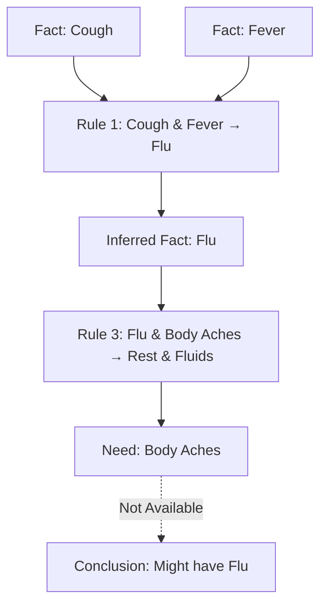
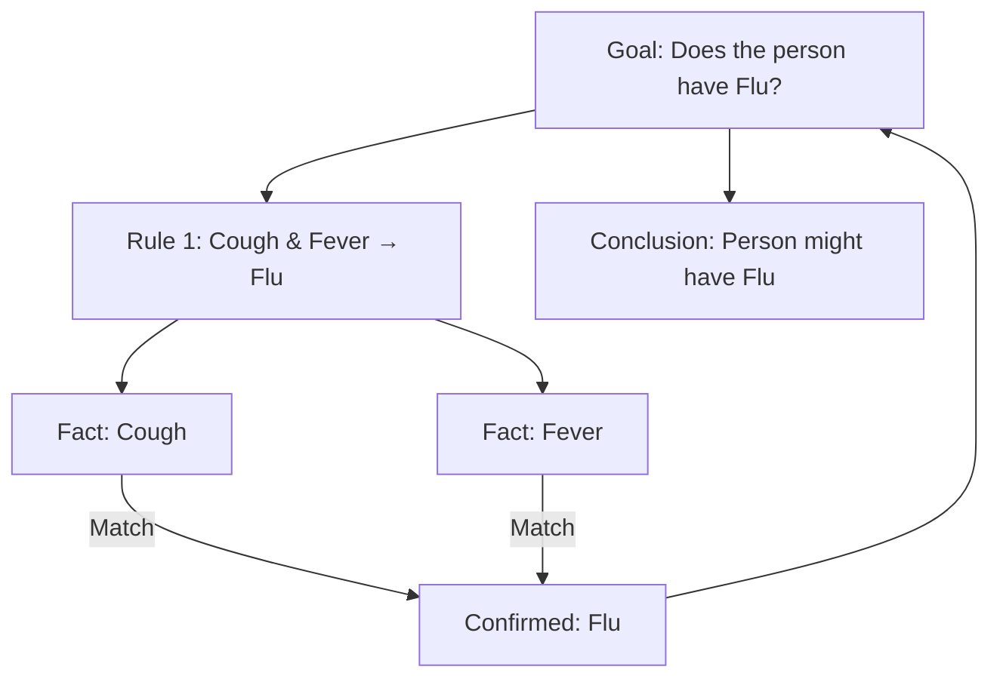

# Forward chaining 

  - **Forward chaining**: Starts with known facts and applies rules to infer new facts.
   
##  example
   Certainly! Below are **Mermaid diagrams** illustrating both **Forward Chaining** and **Backward Chaining** using a **disease diagnosis** example. Each diagram visualizes the reasoning process step-by-step.

---

## **1. Forward Chaining Example**

### **Scenario: Diagnosing Flu**

**Rules:**
1. **Rule 1**: If a person has a cough and fever, they might have the flu.
2. **Rule 2**: If a person has a sore throat, they might have strep throat.
3. **Rule 3**: If a person has the flu and body aches, recommend rest and fluids.

**Initial Facts:**
- The person has a **cough** and a **fever**.

### **Mermaid Diagram:**

### **Explanation:**

1. **Start with Facts**: The person has a **cough** and a **fever**.
2. **Apply Rule 1**: Since both cough and fever are present, infer **Flu**.
3. **Apply Rule 3**: To recommend rest and fluids, body aches are also needed. However, **body aches** are not available.
4. **Conclusion**: The system concludes that the person **might have the flu**.

---
## source
- [forward eg, yt](https://youtu.be/PBTSdx_C9WM)
---
# backwardChanning
- **Backward chaining**: Starts with a goal and works backward to find which rules and facts can help achieve
## **2. Backward Chaining Example**

### **Scenario: Verifying if the Person Has Flu**

**Goal:** Determine if the person has the **flu**.

**Rules:**
1. **Rule 1**: If a person has a cough and fever, they might have the flu.
2. **Rule 2**: If a person has a sore throat, they might have strep throat.
3. **Rule 3**: If a person has the flu and body aches, recommend rest and fluids.

**Initial Facts:**
- The person has a **cough** and a **fever**.

### **Mermaid Diagram:**

### **Explanation:**

1. **Start with Goal**: Determine if the person has the **flu**.
2. **Identify Relevant Rule**: **Rule 1** can lead to the flu conclusion.
3. **Check Conditions**: Verify if the person has a **cough** and a **fever**.
4. **Confirm Facts**: Both conditions are met.
5. **Conclusion**: The system confirms that the person **might have the flu**.

---

## **Summary of Forward vs. Backward Chaining**

| Feature              | **Forward Chaining**                                          | **Backward Chaining**                         |
| -------------------- | ------------------------------------------------------------- | --------------------------------------------- |
| **Approach**         | Data-driven                                                   | Goal-driven                                   |
| **Starting Point**   | Begins with available facts                                   | Begins with a specific hypothesis or goal     |
| **Process**          | Applies rules to infer new facts                              | Works backward from the goal to confirm facts |
| **Use Case Example** | Monitoring multiple conditions to infer all possible outcomes | Verifying a specific condition or diagnosis   |

---

---
Tags: #content-creation

#Other_Data_Operations
