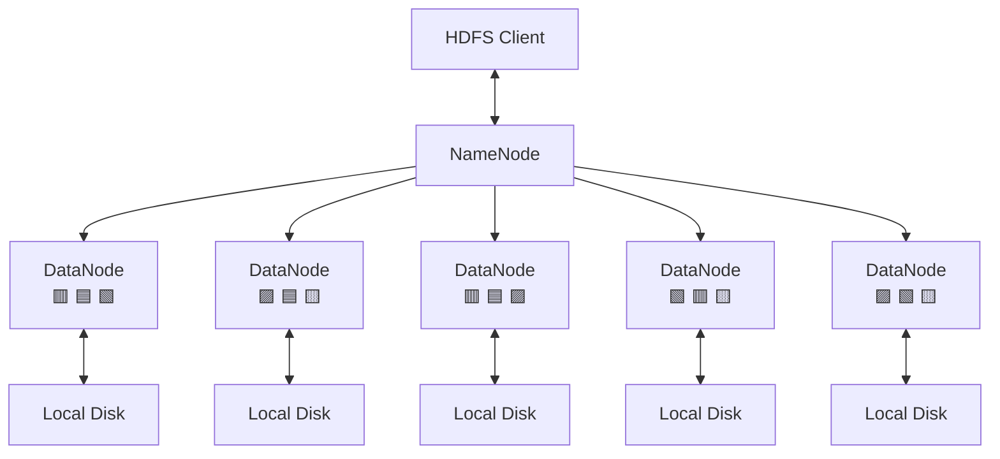
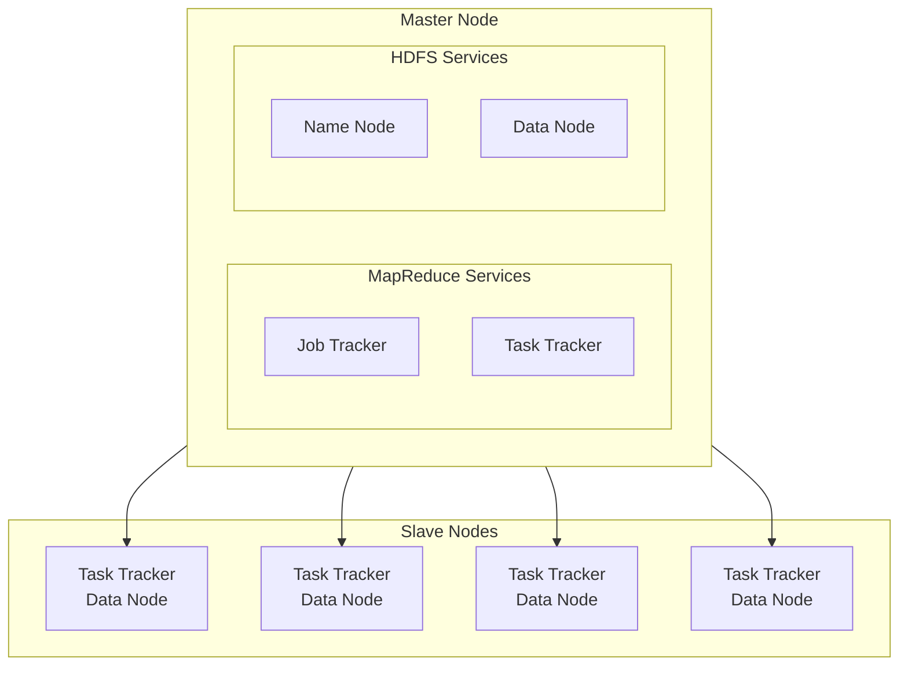
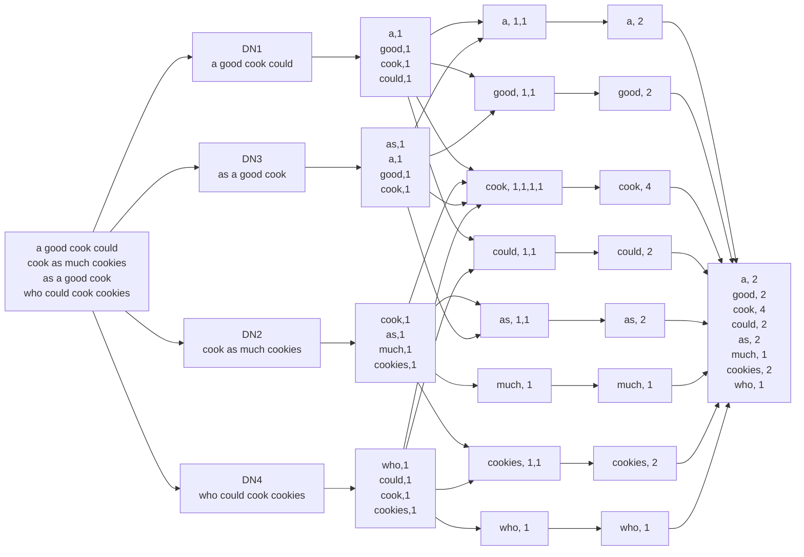

## Big data 
The characteristics of big data :

1. **Volume (The Scale):** The sheer mathematical size of the data. We are no longer talking about Megabytes; we are talking about Terabytes, Petabytes, or Exabytes of data sitting in servers.
    
2. **Velocity (The Speed):** The pace at which the data is generated and needs to be processed. _Example:_ The New York Stock Exchange generating millions of trade ticks a second, or live Visa credit card swipes.
    
3. **Variety (The Forms):** Data no longer comes in nice, neat Excel rows. It is split into three sub-types:
    
    - _Structured:_ Nice relational database tables with fixed columns (e.g., a Bank CSV).
        
    - _Semi-Structured:_ Has tags or markers to separate data, but no rigid table (e.g., **JSON** or **XML** code).
        
    - _Unstructured:_ Pure chaos. MP3 audio files, 4K video, JPEG images, or unhinged Reddit comments.
        
4. **Veracity (The Trust):** The _quality_ and reliability of the data. If a dataset is full of Twitter bots, typos, missing timestamps, and corrupted files, it has **low veracity**.
    
5. **Value (The "So What?"):** (information) The ultimate business goal. Having 40 Petabytes of data is completely useless unless a data scientist can extract a pattern from it that makes the company money or solves a problem.

---
## HDFS the way to store the bigdata Hadoop , also called Apache Hadoop 

uses hierarchical data storage, works on existing hardware so is cost effective

2 main components of HDFS are

- Name Node: the box or the master nodes ,  
	- This is the physical master server. It does not store the actual user data files (like your images or videos). Instead, it acts as the **central directory**. It stores the **metadata**—information about the file system, such as the file name, permissions, and which DataNodes are holding the individual blocks of your data
- data nodes: where the actual data is stored,
	-  **DataNodes are indeed computers (servers)**. In the context of _HDFS_ (Hadoop Distributed File System), a **DataNode** refers to a server machine that is responsible for storing the actual data blocks

features:
1. it is an distributed storage system for parallel access and control of the data where Name Node stores meta data of the data nodes infos and how much data stored in which data nodes.
2. replication : it replicates the certain datas 3 times in random data nodes , for fault tolerance, such as failure of a data node  another data note will be available.
3. rack awareness: rack is the  thousands of computers (nodes) are physically grouped together into **racks**. and hdfs stores a data copy in different racks so  the  data is not lost and quick to access for user by connecting to closest rack as rack awareness give rack address awareness also 
### Name Node
it has the:
- Fsimage: the complete file structure 
- Edit Logs: the editeds are stored as logs
- secondary name node : updates the Fsimage according to latest changes in the Edit Logs
- Heart beat : the data nodes sends a signal on eevery 3 seconds so show its active if signal is missing  the data node gets replicated in other data computer

### Read and write process
read:
`client  ->  Name Node -> metadata -> data nodes -> data -> read`

write:
 `client  ->  Name Node -> metadata -> data nodes -> data -> write `

write is expensive as we have to edit on each replicated places 

### MAP REDUCE HADOOP

it helps to parallel process the big data ,stored in the different data nodes in the  apache Hadoop. for efficiency and effectiveness. 

it has two stages:
MAPPER : divides  the big data to small chunks as key value pair , for process   ,
REDUCE : it reduces or combines the processed output from mapper into a single output.

demons(software works on background runner):
- job tracker:  sheduler and resources provider , monitoring , assigning tasks to the available TaskTrackers
- task tracker: it is the processor , and it process going to the data nodes as its expensive to call the data  , executes the work assigned to it by the JobTracker. It runs the specific **Map** or **Reduce** tasks

Example of process:

`Input -> splitting -> mapping (key:value) -> suffeling -> reducing -> final result`

