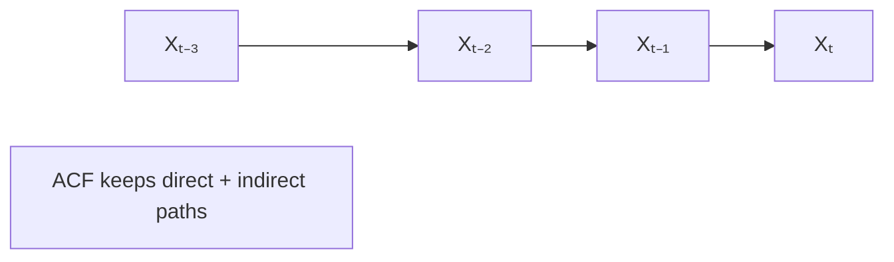
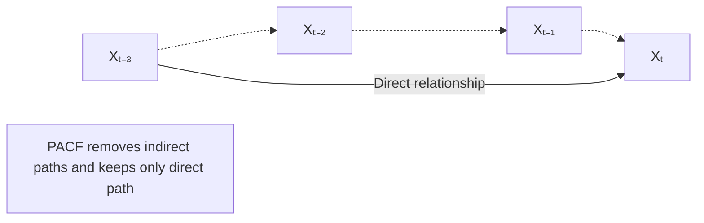

[[DataScience/Stats/notes/Autocorrelation |Autocorrelation]] Function (ACF) & Partial Autocorrelation Function (PCF) how much of the past we need to predict the future. If you want to predict tomorrow's stock price or web traffic, do you need to look at just yesterday, or do you need to look at the last 5 days?

## [[datascience/stats/notes/1. intro - time series analysis|Stationary]]

there are two types: Strong and Weak. 99% of real world problems are weak types.

## ACF
here the middle lag matters 

formula:
 
$$
\rho_k =
\frac{\operatorname{Cov}(X_t,X_{t-k})}
{\sqrt{\operatorname{Var}(X_t)\operatorname{Var}(X_{t-k})}}
$$

or for staionary data:

$$
\rho_k = \frac{\gamma_k}{\gamma_0}
$$

where:  $\gamma_k = \operatorname{Cov}(X_t,X_{t-k})$

## PACF

here the middle lags doesn't matter

formula:

$$
\alpha_k
=
\operatorname{Corr}
\left(
X_t,
X_{t-k}
\mid
X_{t-1},X_{t-2},\ldots,X_{t-k+1}
\right)
$$
- The PACF at lag k is the correlation between $X_t$  and $X_{t−k}$	after removing the effects of intermediate lags

example for lag3:

$$
\alpha_3
=
\operatorname{Corr}
\left(
X_t,
X_{t-3}
\mid
X_{t-1},X_{t-2}
\right)
$$

 
